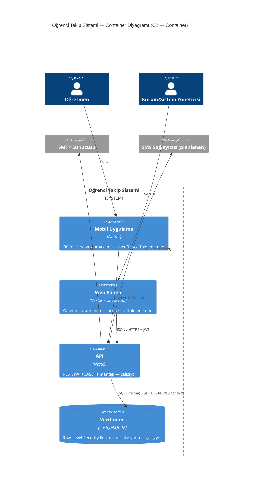

# Öğrenci Takip Sistemi

[](https://github.com/Mohamedattiadev/Ogrenci_Takip/actions/workflows/ci.yml)
[](.nvmrc)
[](pnpm-workspace.yaml)
[](#lisans)

Yurt/kurum öğrenci **yoklama takip sistemi**. Öğretmenler **mobil uygulamadan** (offline dahil) yoklama alır; kurum/yurt yöneticileri ve sistem yöneticisi **web panelinden** öğrenci/grup/program yönetir ve rapor alır. Her iki istemci de tek bir **NestJS API** ve **PostgreSQL** üzerinden çalışır.

- **Stack:** NestJS 10 API · Next.js web paneli (planlanan) · Flutter mobil (planlanan) · Prisma/PostgreSQL 16 (Row-Level Security ile çoklu kurum izolasyonu)
- **Kapsam, yapılan/kalan checklist'i, mimari kararların gerekçesi, sorun giderme:** [`PLAN.md`](./PLAN.md)
- **C4 diyagramları + ADR'ler:** [`docs/architecture/`](./docs/architecture/)

## Mimari — Container görünümü (C2)

Tam C4 seti (Context/Container/Component) için [`docs/architecture/`](./docs/architecture/README.md)'e bakın. Kaynak: [`docs/architecture/c4/container.mmd`](./docs/architecture/c4/container.mmd).



## Hızlı başlangıç

### Ön koşullar

| Araç                    | Sürüm          | Ne için                                                                                                          |
| ----------------------- | -------------- | ---------------------------------------------------------------------------------------------------------------- |
| Node.js                 | 20+ (`.nvmrc`) | her şey                                                                                                          |
| pnpm                    | 9+             | `corepack enable && corepack prepare pnpm@9.15.0 --activate`                                                     |
| Docker + Docker Compose | güncel         | yerel PostgreSQL                                                                                                 |
| `psql` istemcisi        | herhangi       | Row-Level Security SQL'ini uygulamak için — Ubuntu: `apt install postgresql-client`, macOS: `brew install libpq` |

### Kurulum (bir kere)

```bash
git clone <repo-url> && cd Ogrenci_Takip
pnpm install

# İKİ ayrı .env dosyası gerekir — tek bir kök .env YETMEZ:
# Prisma CLI packages/db/.env'i okur, Nest (apps/api) kendi klasöründeki .env'i okur.
cp .env.example packages/db/.env
cp .env.example apps/api/.env

docker compose -f infra/compose/docker-compose.dev.yml up -d
pnpm db:migrate                        # tabloları oluşturur (şema-sahibi rolüyle)
pnpm --filter @yoklama/db rls:apply    # RLS rollerini/politikalarını kurar
pnpm db:seed                           # örnek geliştirme verisi
```

> Varsayılan Postgres portu **5432**'dir. Eğer makinenizde zaten kullanılıyorsa: `POSTGRES_PORT=5442 docker compose -f infra/compose/docker-compose.dev.yml up -d` ve her iki `.env` dosyasındaki portu da değiştirin.

### Çalıştırma (her oturumda)

```bash
docker compose -f infra/compose/docker-compose.dev.yml up -d
pnpm --filter @yoklama/api dev          # → :3001  (Swagger: /docs)
```

Kontrol: `curl http://localhost:3001/api/v1/auth/login -X POST -H 'Content-Type: application/json' -d '{"email":"ogretmen@example.org","password":"Deneme123!"}'` bir `accessToken` dönmeli.

| Servis                 | Adres                                                                                                                      |
| ---------------------- | -------------------------------------------------------------------------------------------------------------------------- |
| API                    | http://localhost:3001/api/v1                                                                                               |
| Swagger dokümantasyonu | http://localhost:3001/docs                                                                                                 |
| PostgreSQL             | localhost:5432 — `yoklama_owner` / `owner_pw` (sema sahibi), `app_runtime` / `app_runtime_pw` (çalışma zamanı, RLS'e tabi) |

Seed kullanıcılar (şifre hepsinde `Deneme123!`): `sistem.yoneticisi@example.org` (SUPER_ADMIN), `kurum.yoneticisi@example.org` (INSTITUTION_ADMIN), `ogretmen@example.org` (TEACHER).

### Sorun giderme

| Belirti                                                     | Sebep                                          | Çözüm                                                                                             |
| ----------------------------------------------------------- | ---------------------------------------------- | ------------------------------------------------------------------------------------------------- |
| `docker compose up` → "port is already allocated"           | 5432 zaten kullanımda                          | `POSTGRES_PORT=5442 docker compose ... up -d`, her iki `.env`'de portu güncelle                   |
| Giriş (`/auth/login`) 500 hatası                            | RLS SQL'i henüz uygulanmadı                    | `pnpm --filter @yoklama/db rls:apply`'i atlamadığınızdan emin olun                                |
| `pnpm db:migrate` → "Authentication failed ... app_runtime" | Migration script'i bozulmuş/elle değiştirilmiş | `packages/db/package.json`'daki `migrate:dev` script'i `with-owner-url.js` kullanmalı, dokunmayın |
| Yeni eklediğim tabloya erişim boş dönüyor                   | Yeni tabloya RLS politikası eklenmedi          | `packages/db/prisma/rls-policies.sql`'e tabloyu ekleyip `rls:apply`'i tekrar çalıştırın           |

Daha fazla detay ve gerçekte karşılaşılmış hatalar için: [`PLAN.md` § Backend](./PLAN.md#4-backend-appsapi--durum-tamamlandı-uçtan-uca-test-edildi).

## Depo yapısı

```
apps/
  api/             NestJS backend — tek gerçek API kaynağı (çalışıyor)
  web/             Next.js yönetim paneli (planlanan)
  mobile/          Flutter uygulaması (planlanan)
packages/
  db/              Prisma şeması, migration'lar, RLS politikaları, seed
  design-tokens/   Tek JSON kaynaktan Tailwind + Flutter tema üretimi
  shared-types/    API'nin OpenAPI spec'inden üretilen TS tipleri (placeholder)
  shared-dart/     API'nin OpenAPI spec'inden üretilen Dart/Dio client (placeholder)
infra/compose/     Geliştirme ve prod docker-compose dosyaları
docs/architecture/ C4 diyagramları (Mermaid) + ADR'ler
```

Her modülün gerekçesi ve tam durumu için: [`PLAN.md`](./PLAN.md).

## Sık kullanılan komutlar

| Görev                               | Komut                                                                 |
| ----------------------------------- | --------------------------------------------------------------------- |
| Tek bir uygulamayı çalıştır         | `pnpm --filter @yoklama/<isim> dev`                                   |
| Sadece altyapı (Postgres)           | `docker compose -f infra/compose/docker-compose.dev.yml up -d`        |
| Lint / typecheck / build            | `pnpm lint` · `pnpm typecheck` · `pnpm build`                         |
| Yeni DB migration                   | `pnpm --filter @yoklama/db migrate:dev` (şemayı değiştirdikten sonra) |
| RLS politikalarını (yeniden) uygula | `pnpm --filter @yoklama/db rls:apply`                                 |
| Prisma Studio                       | `pnpm --filter @yoklama/db studio`                                    |
| Tasarım tokenlarını derle           | `pnpm tokens:build`                                                   |
| API'nin OpenAPI spec'ini çıkar      | `pnpm --filter @yoklama/api openapi:dump`                             |

## Kurallar

- **Commit'ler:** [Conventional Commits](https://www.conventionalcommits.org/), `commitlint` ile zorunlu kılınır (bkz. `.husky/commit-msg`).
- **Format/Lint:** Prettier + ESLint (`pnpm lint`), pre-commit hook'unda otomatik (`lint-staged`).
- **Mimari kararlar:** [`docs/architecture/adrs/`](./docs/architecture/adrs/) — yeni bir mimari karar aldığınızda oraya bir ADR ekleyin.

## Lisans

Özel (private) depo — Türkiye Diyanet Vakfı için geliştirilmektedir. Açık kaynak değildir.
